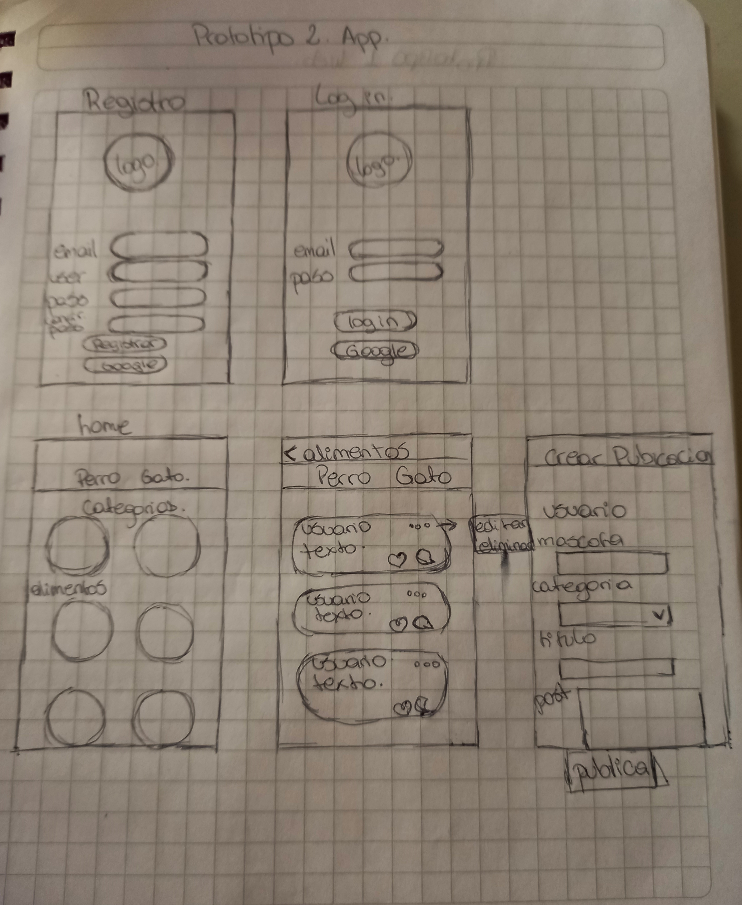
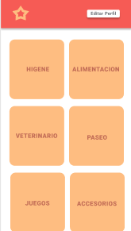
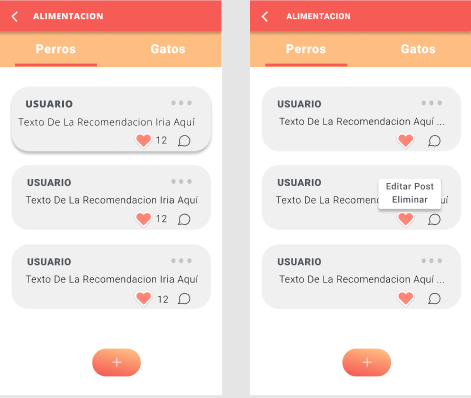

# Lucchi - Creando una Red Social 😺🐶

## Índice

- [1. Preámbulo](#1-preámbulo)
- [2. Resumen del proyecto](#2-resumen-del-proyecto)
- [3. Historias de Usuario](#3-Historias-de-Usuario)

## 1. Preámbulo

Lucchi nace como red Social, con la idea de crear una comunidad para dueños de mascotas, donde puedan encontrar y compartir datos sobre distintas categorías del cuidado de sus mascotas.
Necesitas un alimento especifico para tu gatito? en Lucchi podrás encontrar el dato que te indique donde podras comprarla.

## 2. Resumen del proyecto

Este proyecto se realizo bajo los parámetros de 'mobile first', donde primero se aplico el diseño y la construccion del codigo pensando en la vista movil, y luego se modifico para otras vistas, como tablets y computadores.
La red social cuenta con una vista principal donde se le da a elegir al usuario si desea inicar sesion o registarse.

Sin importar si el usuario desea iniciar sesión o realizar el registro de su cuenta, en ambos casos, el usuario tendra la opcion utilizar su email y contraseña o Google.

Una vez el usuario inicie sesión o realice su registro en Lucchi, podra ingresar al muro, donde se visualizará, post ya publicados, también tendra las opciones de crear, editar o borrar publicaciones. Además podra dar y recibir likes, y visualizar el total de likes recibidos.

## 3. Historias de Usuario

Para llegar al resultado final de nuestra red social, trabajamos con metodología ágil y con historias de usuarios. Las que fueron las siguientes.

### Primera Historia de Usuario

Vista de inicio de sesión y registro

Pensando en el usuario, se crea una pagina principal, cuyas opciones son, ir a la vista de inicio de sesion o la vista de registro. En ambas vistas se encuentra la opcion de usar email y contraseña, o utilizar una cuenta de google, para realizar el inicio de sesion o registro.

Comenzamos con un prototipo de baja fidelidad de las diferentes vistas disponibles en nuestra red social y partimos con las vista de bienvenida, vista registro y vista iniciar sesion. Luego de realizar el prototitpo de baja fidelidad, comenzamos a crear y definir nuestro proyecto, basandonos en el prototipo de alta fidelidad. Para definir estructura de las vistas y definir colores. Para su creacion y funcionalidad se implemento HTML, CSS, JavaScript y firebase.

### Segunda Historia de Usuario

Visualizacion de categorias

Pensando ens el usuario, se agregaron categorias para que usuario pudiera interactuar con ellas y asi poder filtrar la informacion, haciendo mas efectiva su busqueda.

### Tercera Historia de Usuario

Publicaciones en muro
Pensando en el usuario, se implemento la opcion de crear publicaciones, para asi, poder compartir la imformacion con los demas usuarios. Ademas se penso en poder editar y borrar estas publicaciones, en caso de cometer un error.

### Cuarta Historia de Usuario

Dar likes y tener una cuenta de ellos

Se creo la opcion de poder dar likes a las publicaciones y ver el total de estos. Esta opcion esta disponible para todas las publicaciones, sin importar el usuario.

